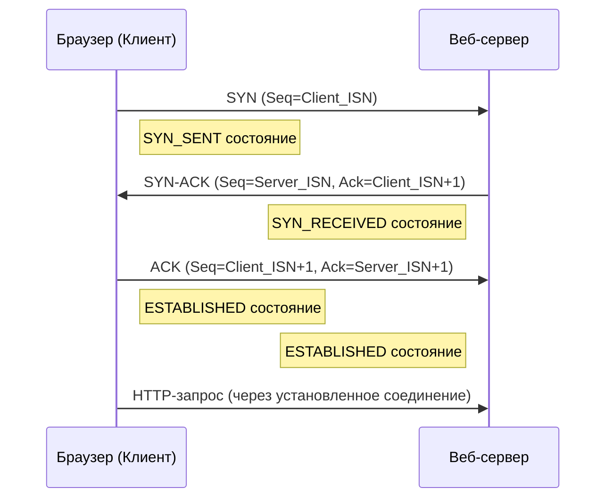
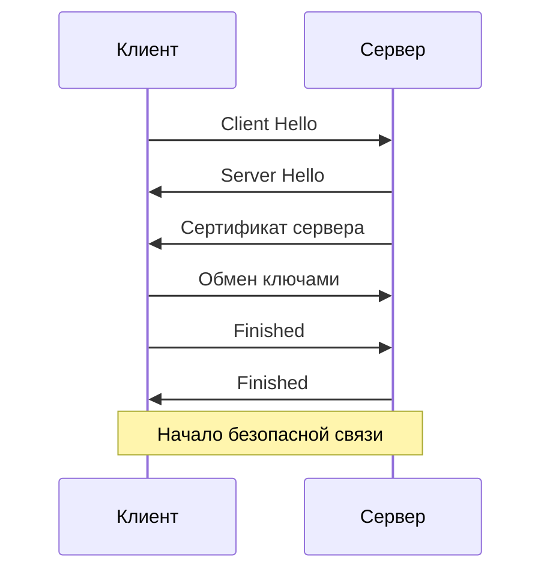

# Что происходит после ввода домена ozon.ru? Расскажи о всем, кроме рендеринга страницы

В браузере вбиваем любой домен (например, `ozon.ru` или `ya.ru`). Нажимаем Enter. Нам интересно не то, что касается самого браузера (обработка HTML, CSS и JavaScript), а то, что за пределами (DNS и прочее). То есть сетевые взаимодействия

## Кратко
- **Поиск адреса:** Браузер спрашивает у DNS (это как телефонная книга интернета), где находится "ozon.ru". DNS даёт адрес сервера
- (HTTPS) Рукопожатие через установку TLS/SSL-соединения
- **Подключение:** Браузер делает запрос к серверу по этому адресу
- **Запрос**: Браузер просит через http-request: "Дай мне страницу ozon.ru"
- **Ответ**: Сервер собирает страницу и отправляет её обратно
- **Передача**: Данные летят через интернет к тебе
- **Безопасность**: Браузер проверяет, что всё защищено (если есть HTTPS)
- **Дополнительно**: Браузер загружает картинки и другие штуки, если они нужны

## 1.  DNS-запрос (Domain Name System):
   Сначала нам нужно преобразовать понятное человеку доменное имя (например, `ozon.ru`) в машиночитаемый IP-адрес сервера (например, `5.61.236.230`)
   - Поиск в кэше: Локальный кэш браузера -> Кэш операционной системы -> DNS-резолверу (Google DNS `8.8.8.8` или Cloudflare `1.1.1.1`)
   -  Если адреса нет даже в кэше резолвера, он начинает рекурсивный запрос
	   - Обращается к **корневым DNS-серверам** (Root Servers), которые знают, где искать серверы для доменов верхнего уровня (TLD) — `.ru`, `.com` и т.д
	   - Корневые серверы указывают на **DNS-серверы домена верхнего уровня (TLD)** для `.ru`
	   - Серверы TLD `.ru` указывают на **авторитативные DNS-серверы** для домена `ozon.ru` (эти серверы управляются владельцем домена или их хостинг-провайдером)
	   - Авторитативные серверы для `ozon.ru` возвращают **IP-адрес(а)**, связанные с запрошенным доменным именем (или именем поддомена, если оно было указано)
	   - Резолвер получает IP-адрес, кэширует его (на время, указанное в записи DNS - TTL) и возвращает его операционной системе, которая передает его браузеру.
1. Установка TCP-соединения:

   Устанавливаем надежное двустороннее соединение между вашим компьютером и веб-сервером с помощью процесса TCP Three-Way Handshake:
   - Клиент отправляет серверу пакет с флагом `SYN` (Synchronize - запрос на установку соединения)
   - Сервер отвечает пакетом `SYN-ACK` (Synchronize-Acknowledgment - подтверждение и свой запрос)
   - Клиент отправляет пакет `ACK` (Acknowledgment - подтверждение)
   - Надежное TCP-соединение установлено!

## 2.  Установка TLS/SSL-соединения (HTTPS)
Это так называемое "рукопожатием" (handshake), которое позволяет клиенту (например, браузеру) и серверу договориться о шифровании и начать безопасный обмен данными. 

1. → Клиент приветствует сервер  
    Клиент отправляет сообщение "Client: Hello", в котором указывает поддерживаемые шифры, случайное число и версию TLS
    
2. ← Сервер отвечает  
    Сервер отправляет "Server: Hello", выбирает шифр, добавляет свое случайное число и подтверждает версию TLS.
    
3. ← Сервер предъявляет сертификат
    Сервер отправляет свой цифровой сертификат с публичным ключом, подписанный доверенным центром (CA).
    
4. 🤔 Клиент проверяет сертификат  
    Клиент убеждается, что сертификат валиден и подписан доверенным CA.
    
5. → Обмен ключами  
    Клиент создает "предварительный секрет", шифрует его публичным ключом сервера и отправляет серверу.
    
6. 🤔 Генерация ключей сессии  
    Обе стороны используют предварительный секрет и случайные числа для создания одинаковых симметричных ключей сессии.
    
7. ↔ Подтверждение  
    Клиент и сервер обмениваются зашифрованными сообщениями "Finished", чтобы подтвердить успешное завершение рукопожатия.
    
8. ↔ Безопасная связь  
    Теперь данные передаются в зашифрованном виде с использованием ключей сессии.

## 3.  Отправка HTTP-запроса
Запрашиваем HTML-страницу у веб-сервиса

Браузер формирует **HTTP-запрос** (чаще всего `GET / HTTP/1.1` или `GET / HTTP/2` для главной страницы)

В заголовках (`Headers`) запроса передается критически важная информация:
- `Host: ozon.ru` (обязателен для виртуальных хостов - когда на одном IP-адресе работает много сайтов)
- `User-Agent`: Информация о браузере и ОС
- `Accept`: Типы контента, которые понимает браузер (HTML, изображения и т.д.)
- `Accept-Language`: Предпочитаемые языки
- `Cookie`: Куки, ранее сохраненные браузером для этого домена (если есть)
- `Connection: keep-alive` (запрос на поддержку соединения для последующих запросов)
- и так далее

## 4.  Обработка запроса на сервере и CDN:
 Получить запрошенный ресурс или сгенерировать его динамически.
 
 Запрос поступает на **веб-сервер** (например, Nginx, Apache, IIS) или на **CDN (Content Delivery Network)
 
 - **CDN** (если используется)
   Крупные сайты (как ozon.ru или ya.ru) почти всегда используют CDN. Если запрашиваемый ресурс (например, статический файл - изображение, CSS, JS) есть в кэше ближайшего к вам сервера CDN (Edge Server), он возвращается напрямую оттуда, что значительно ускоряет загрузку. Если ресурса нет в кэше CDN или он динамический, CDN перенаправляет (проксирует) запрос на **исходный сервер (Origin Server)** сайта.
 - **Веб-сервер**
   Получает запрос. Если запрошен статический файл (например, `logo.png`), веб-сервер находит его на диске и отправляет обратно. Если запрошена динамическая страница (например, главная страница интернет-магазина), веб-сервер передает запрос **бэкенд-приложению** (например, написанному на Python/Django, PHP, Java, Node.js, Go и т.д.)
 - **Бэкенд-приложение**
   Выполняет необходимую бизнес-логику: обращается к **базе данных** (MySQL, PostgreSQL, MongoDB и т.д.), кэшам (Redis, Memcached), другим микросервисам или API, чтобы собрать нужные данные. Затем генерирует HTML-страницу (или JSON для API)
 
 Сгенерированный ответ (HTML, изображение, JSON и т.д.) вместе с **HTTP-заголовками** (статус-код `200 OK`, `Content-Type`, `Cache-Control`, `Set-Cookie` и др.) отправляется обратно через веб-сервер (и CDN, если он был задействован) по установленному TCP/TLS соединению к вашему браузеру.

## 5.  Получение ответа браузером:
Браузер получает HTTP-ответ
- Он анализирует заголовки (например, `Set-Cookie` сохраняет куки, `Cache-Control` указывает, можно ли кэшировать ресурс)
- По заголовку `Content-Type` (например, `text/html; charset=UTF-8`) браузер понимает, что получил HTML-страницу.

**Только после всего этого** браузер начинает свою работу:
1.  **Парсинг HTML:** Построение DOM-дерева.
2.  **Обработка CSS:** Парсинг CSS, построение CSSOM-дерева, комбинация DOM и CSSOM в дерево рендеринга (Render Tree).
3.  **Выполнение JavaScript:** Загрузка и исполнение JS-кода (который может модифицировать DOM/CSSOM, отправлять новые HTTP-запросы (AJAX/Fetch) и т.д.).
4.  **Рендеринг страницы:** Расчет макета (Layout) и отрисовка (Paint) пикселей на экране.